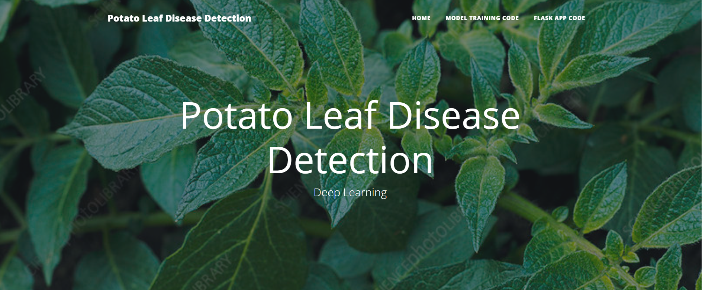

# Potato_Leaf_Disease_Detection_using-_DL
Potato Leaf Disease Detection is a Flask web application designed to help farmers and agricultural experts identify diseases in potato leaves. Using advanced deep learning techniques, this app analyzes uploaded images of potato leaves to predict whether they are healthy, affected by early blight, or suffering from late blight.

## Key Features

- **Image Upload**: Easily upload images of potato leaves directly through the web interface.
- **Disease Detection**: Utilize a trained deep learning model to classify the uploaded images into three categories: Healthy, Early Blight, and Late Blight.
- **Instant Results**: Get immediate feedback and insights on the health status of your potato plants.
- **User-Friendly Interface**: Simple and intuitive design for easy navigation and use.

## How It Works

1. **Upload Image**: Users can upload an image of a potato leaf using the provided upload option on the web app.
2. **Image Analysis**: The app processes the image through a convolutional neural network trained on a dataset of potato leaf images.
3. **Prediction Display**: The result, indicating whether the leaf is healthy or affected by early or late blight, is displayed on the screen.

## Technologies Used

- **Flask**: For building the web application framework.
- **TensorFlow/Keras**: For creating and training the deep learning model.
- **OpenCV**: For image preprocessing and enhancement.
- **HTML/CSS/JavaScript**: For designing the front-end interface.

